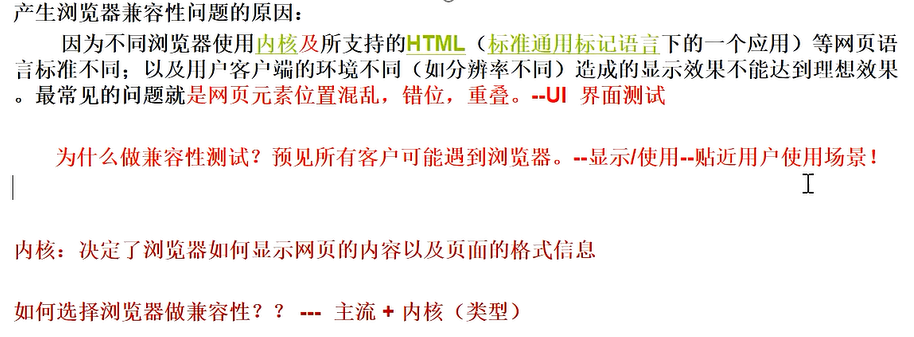
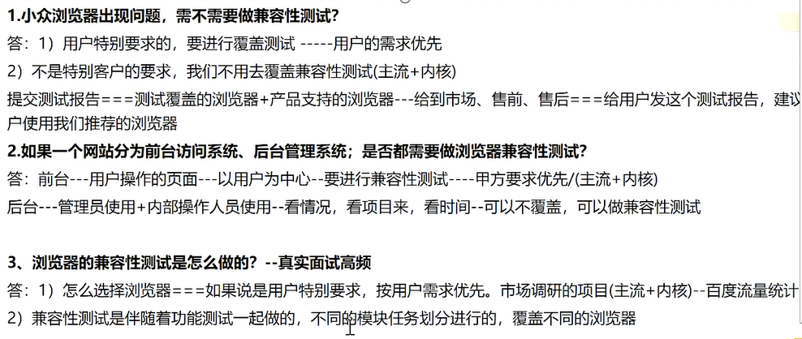

# 一、软件测试基础

## 1. 什么是软件测试基础

在软件中查找缺陷和错误，然后提交给开发人员进行修改，最终保证高质量的软件交到用户手中。

## 2. 软件测试基础的定义

==软件=文档+数据+程序==

软件产品由文档、数据和程序组成，那么软件测试基础就是对软件开发过程中形成的文档、数据以及程序进行相关的测试。其目的在于检验它是否满足规定的需求或弄清预期结果与实际结果之间的差别。


### 软件质量

软件质量是指软件产品==满足基本需求及隐式需求==的程度。软件产品满足基本需求是指其能满足软件开发时所规定需求的特性；其次是软件产品满足隐式需求的程度。

软件质量的定义是指软件经过开发测试完成后，软件所展现出来的各项功能特性是否满足需求文档，是否满足用户的需求。如果满足，则表明这个软件质量很好；如果不满足，则表明软件质量不好。


## 3. 软件测试基础的目的

- 对于软件开发来说

    ​		软件测试基础通过找到的问题缺陷帮助开发人员找到开发过程中存在的问题，包括软件开发的模式、工具、技术等方面存在的问题与不足，预防下次缺陷的产生。

- 对于软件测试基础来说

    ​		使用最少的人力、物力、时间等找到软件中隐藏的缺陷，保证软件的质量，也为以后软件测试基础积累丰富的经验。

- 对于客户需求来说

    ​		软件测试基础能够检验软件是否符合客户需求，对软件质量进行评估和度量，为客户评审软件提供有力的依据。


## 4. 软件测试基础的分类

1. 按照测试阶段分

- 单元测试

    ​		主要是测试程序代码，为的是确保各单元模块被正确的编译，比如有具体到模块的测试，也有具体到类，函数，方法的测试等。一般是开发来完成

- 集成测试

    ​		单元测试后，将各单元组合成完整的体系，测试软件单元之间的接口是否正确，数据能否正常传递。比如注册和重置功能是否能够联通等

- 系统测试

    ​		把软件系统搭建起来，按照软件规格说明书中所要求，测试软件其性能等是否和用户需要一致，在系统中运行是否存在漏洞等。根据测试用例，进行完整的系统测试

- 验收测试

    ​		主要就是用户在拿到软件的时候，在使用现场，会根据前边所提到的需求，以及规格说明书来做相应的测试，以确定软件达到符合效果。用户对软件进行验收

    - α测试
    
        ​		软件上线之前进行的版本测试。在受控的环境中进行，由用户在开发者的场所进行，并且在开发者对用户的指导下进行测试，开发者负责记录发现的错误和使用中遇到的问题。
    
    - β测试
    
        ​		软件上线之后进行的版本测试。在开发者不能控制的环境中的真实应用，由软件的最终用户们在一个或多个客户场所下进行，由用户记录在测试中遇到的一系列问题，并定期报给开发者。
    
    

2. 按照测试技术分

- 黑盒测试
- 白盒测试
- 灰盒测试（接口测试）
    - 灰盒测试关注输出对于输出的正确性；同时也关注内部表现，但这种关注不想白盒测试那样详细、完整、只是通过一些表征性的现象、事件、标志来判断内部的运行状态。


3. 按照测试包含的内容划分

- 功能测试

    ​        测试软件的功能是否满足客户的需求，包括准确性、易用性、适合性、互操作性等。

    - α测试（开发环境）

        ​		软件上线之前进行的版本测试。在受控的环境中进行，由用户在开发者的场所进行，并且在开发者对用户的指导下进行测试，开发者负责记录发现的错误和使用中遇到的问题。

    - β测试（预生产环境）

        ​		软件上线之后进行的版本测试。在开发者不能控制的环境中的真实应用，由软件的最终用户们在一个或多个客户场所下进行，由用户记录在测试中遇到的一系列问题，并定期报给开发者。

- 性能测试

    ​		测试软件的性能是否满足客户的需求，性能测试包括：负载测试、压力测试、兼容性测试、可移植性和健壮性测试等。
    
- 外观界面测试

- 兼容性测试

- 易用性测试

- 安全性测试


4. 按照测试手段分

- 手工测试
- 自动化测试


5. 其他分类

- 回归测试

    ​		对修改后的程序重新进行测试确认原有的缺陷已经消除并且没有引入新的缺陷。

- 随机测试（探索测试）

    ​		（monkey测试）测试人员根据经验对软件进行功能和性能抽查。

- 冒烟测试

    ​		基本功能，基本模块是否能正常运行。在进行正式测试前对主要功能核心功能进行的测试。


## 5. 软件生命周期

- 问题定义
- 需求分析
- 软件设计
- 软件开发
- 软件测试基础
- 软件维护


## 6. 软件测试基础模型

### 1. 瀑布模型


- 优点
    1. 为项目提供按阶段划分的检查点；
    2. 当前阶段完成后，只需要关注后一个阶段；
- 缺点
    1. 瀑布模型的突出缺点是==不适应用户需求的变化==；
    2. 由于开发模型是线性的，用户只有等到整个过程的末期才能见到开发成果，从而增加了开发风险；
    3. 各个阶段的划分完全固定，阶段之间产生大量的文档，极大地增加了工作量；

### 1. V模型


- 优点
    - 将测试分为几个阶段（单元测试、集成测试、系统测试、验收测试）
    - 能够清楚地描述这些测试阶段和开发过程期间各阶段的对应关系
- 缺点
    - 由于需求变更较大，所以返工量大
    - 只能在编码之后才能开始进行测试，早期的需求分析等前期工作没有涵盖其中，因此它不能发现需求分析等早期的错误，这为后期的系统测试、验收测试埋下了隐患。


### 2. W模型


**优点：**

1. 测试和软件开发同步进行；
2. 测试范围不仅包括程序，还包括需求分析、软件设计等前期工作，有利于尽早发现问题；

**缺点：**

​		它将软件开发过程分成需求、设计、编码、集成等一系列的串行活动，无法支持迭代，自发性等需要变更调整的项目。


### 3. 敏捷模型


敏捷模型以用户的需求进化为核心，采用迭代，循序渐进的方法进行软件开发。


#### 3.1 敏捷模型开发方式


### 项目发布流程


## 7. 软件测试基础原则

1. 测试基于客户需求

2. 测试要尽早进行

3. 穷举测试是不可能的

4. 遵循GoodEnough原则

    ​		GoodEnough原则是指测试的投入与产出要适当权衡。

5. 测试缺陷要符合“二八”定理

    ​		80%的缺陷集中在20%的模块中。

6. 避免缺陷免疫

    ​		测试用例反复使用，发现缺陷的能力就会越来越差，测试人员对软件越熟悉就越会忽略一些看起来比较小的问题，发现缺陷的能力也会越差，这种现象被称为软件测试基础的“杀虫剂”现象。它主要是由于测试人员没有及时更新测试用例或是对测试用例和测试对象过于熟悉，形成了思维定势。


## 评审需求文档


> 如何评审需求文档？

1. 正确性：对照用户的原始需求，检查产品人员制定的需求文档是否偏离了用户的原始需求。

2. 明确性：检查需求文档中每一个需求项是否存在一些含糊其辞的词汇，用语是否清晰，是否有歧义。
3. 完整性：对照用户的原始需求，检查产品人员制定的需求文档是否覆盖了用户所提出的所有需求项，每个需求项有没有遗漏用户所提出的一些必要信息。
4. 限制性：每个需求项里是否清晰地描述了这个软件能做什么，不能做什么，能输入什么，不能输入什么，能输出什么，不能输出什么。
5. 优先级：需求文档中的哪些功能比较重要，哪些功能比较次要，是否做了标识和编号。
6. 一致性：检查需求文档里的内容前后是否一致，确保不冲突，不矛盾。


## 8. 软件测试基础流程


1. 分析测试需求

     

    

    ​        测试人员在制定测试计划之前需要先对软件需求进行分析，以便对要开发的软件产品有一个清晰的认识，从而明确测试对象及测试工作范围和测试重点。在分析需求是还可以获取一些测试依据，作为测试计划的基本依据，为后续测试打好基础。此外，分析测试需求也是对软件需求进行测试，以发现软件需求中不合理的地方。

    ​	

    

2. 制定测试计划

3. 设计测试用例

    ​		测试用例编写的原则是==尽量以最少的测试用例达到最大测试覆盖率==。

4. 执行测试

    ​		在执行测试过程中，测试人员要密切跟踪测试过程，记录缺陷，形成报告等。

5. 编写测试报告


## 10. 软件缺陷


---


### 1. 缺陷的类型

1. 软件未实现产品说明书要求的功能；
2. 软件出现了产品说明书不应该出现的错误；
3. 软件实现了产品说明书未提到的功能；
4. 软件未实现产品说明书虽未明确提及但应该实现的功能；
5. 软件难以理解、不易使用、运行缓慢——从测试员的角度看——最终用户会认为不好；


> 表现形式

- 功能、特性没有实现或者部分实现
- 设计不合理，功能特性不明确，逻辑不清楚或者存在矛盾
- 产品实际结果和所期望的结果不一致
- 没有达到需求规格说明书所规定的性能指标
- 运行出错，中断、奔溃、界面混乱
- 数据不正确、精度不够，不完整，格式不统一
- 用户不能接受的其他问题，超时、界面丑陋
- 硬件或者系统软件上存在的其他问题


### 2. 缺陷案例

1. 千年虫问题；
2. 英特尔浮点数除法缺陷；


### 3. 缺陷产生的原因

- 需求不明确
- 软件结构复杂
- 开发人员水平有限
- 项目期限短
- 使用新技术
- 其他原因

>  缺陷产生的根源

- 交流不充分
- 软件的复杂性
- 开发任务的错误
- 需求的变化
- 进度压力


### 缺陷组成元素


### 4. 缺陷分类


### 5. 缺陷处理流程


### 缺陷报告

> 缺陷报告有如下作用：

1. 记录测试结果

2. 方便开发人员进行缺陷的定位

3. 为后期统计缺陷提供依据

    

> 缺陷报告字段说明


> 缺陷状态

`缺陷从测试人员开始， 也应该由测试人员结束。`


| 状态      | 含义                                     |
| --------- | ---------------------------------------- |
| new       | 新建, 缺陷的初始状态                     |
| assigned  | 已指派，分配给具体的开发人员             |
| open      | 打开, 开发人员开始修改缺陷               |
| fixed     | 修复,开发人员修改缺陷完毕                |
| closed    | 回归测试通过,关闭缺陷                    |
| reopen    | 回归测试失败,再次打开                    |
| postpone  | 推迟修改                                 |
| duplicate | 与已提交的Defect重复                     |
| reject    | 拒绝修复，可能为测试人员对于需求理解错误 |


> 严重程度

- 严重程度分为五个等级：

    - Fatal 致命的缺陷 造成系统或应用程序崩溃、死机、系统挂起，或造成数据丢失，主要功能完全丧失，导致本模块以及相关模块异常等问题。
    - Critical 严重错误的软件缺陷 系统的主要功能部分丧失、数据不能保存，系统的次要功能完全丧失。问题局限在本模块，导致模块功能失效或异常退出。 如系统资源占用过大、功能没有做完。
    - Major 一般的软件缺陷 次要功能没有完全实现但不影响使用。 如：提示信息不太准确，或用户界面差，操作时间长，模块功能部分失效等。
    - Minor 较小的软件缺陷 较小错误的软件缺陷，使操作者不方便或遇到麻烦，但它不影响功能性的操作和执行。 例如：对话框弹出位置，步骤较多，输入项太麻烦。
    - Enhancemental 建议问题 由问题提出人对测试对象的改进意见或测试人员提出的建议、质疑。 例如：错别字、颜色、按钮大小。

- 说明

    严重程度的分级，并不统一，有的公司分为3个等级或者4个等级，都是可以的

 

#### bug类型


### 缺陷等级

| 级别 | 定义     | 说明                                                         |
| ---- | -------- | ------------------------------------------------------------ |
| P1   | 立即解决 | 缺陷导致系统几乎不能完全运行、使用，或严重妨碍测试的执行， 需立即修正、尽快修正； |
| P2   | 高级优先 | 缺陷严重，影响测试，需要优先考虑修正，如不超过24小时修正；   |
| P3   | 正常级别 | 缺陷需要修改,只要正常排队修复就可以                          |
| P4   | 低优先级 | 缺陷可以在开发人员有时间的时间修复,若没时间可以不修正        |

- 说明

    有的公司，也会把优先级分为3个或者5个，都是可以的。


> 表现形式

| 分类     | 说明                                                         |
| -------- | ------------------------------------------------------------ |
| 代码问题 | 不满足需求、功能实现错误；对产品或项目质量有影响的bug可统一划入； |
| 设计缺陷 | 页面美观性、协调性、错别字等                                 |
| 用户体验 | 对产品、项目的建议性意见，不强制要求修改                     |
| 性能问题 | 进行性能测试时使用，暂定：网络延时、内存问题、CPU占用、硬盘问题 |
| 安全问题 | 业务功能存在的安全问题                                       |
| 兼容问题 | 在部分环境中表现正常，在部分环境中表现不正常                 |
| 接口问题 | 涉及有模块间数据传递时使用                                   |
| 配置问题 | 由于提供的配置不当或者配置不能够满足实际要求而出现的问题     |
| 其他问题 | 上述不能归纳进来的                                           |


### 缺陷报告书写规范

- 标题
    - 简短
    - 尽量能够体现 原因和结果
    - 准确：避免使用模糊不清的词语
    - 便于他人理解，不要使用俚语、方言词汇
- 原则
    - 完整 他人按照步骤，即可复现问题
    - 简明 不包含夸张、啰嗦的内容
- 内容
    - 测试环境描述
    - 步骤
        - 加上编号
        - 一个步骤不要包含太多步骤
        - 可能将多个步骤合为一个
        - 可以包含 该步骤后的一个中间结果
        - 可使用短语或者短句，不需要复杂句式
    - 实际结果 清楚，不笼统
    - 期望结果 根据需求文档，应该出现的结果
    - 附件 截图、录屏、测试中需要的数据
    - 解决方案/可能的原因（非必须） 如果测试人员能够给出解决方案则更好了。
- 常见错误
    - 人称代词不明确
    - 情绪化语言、强调符号
    - 不确定词汇
    - “幽默”、“梗”
    - 不确定：对于缺陷，测试人员至少需要再次操作，来重现缺陷


### 缺陷统计

- 通过缺陷统计，我们可能得出以下信息

    - 缺陷分布：找出系统的薄弱环境
    - 缺陷状态：根据变化，检查测试和开发的工作情况
    - 人员水平：开发人员出错的数量，测试人员测出的数量
    - 比较历史：对人员水平有所把握
    - 模块难度：较难的模块出问题的可能较大
    - 修复时间：平均修复缺陷需要的时间，越短越好
    - 未修复的缺陷数目：

- 作用

    - 风险评估：能否在计划内的时间发布
    - 缺陷原因：避免反复出现同类型的缺陷
    - 员工技能提升：根据开发和测试人员表现出来的问题，可有针对性提升
    - 团队配置：根据缺陷修复时间，可知道团队配合强弱

- 指标

    - 单位时间（天/周）内报告的缺陷数目
    - 单位时间（天/周）内修复的缺陷数目
    - 累计缺陷报告数量
    - 累计缺陷修复数量
    - 不同严重性的缺陷数
    - 模块与缺陷的对应关系

- 缺陷密度

    单位 缺陷数量/kloc ( kilo lines of code) 计算 总缺陷数量 / 总代码行数 / 1000


### 缺陷报告的原则和重要性

- 重要性
    - 节省开发和测试人员的沟通时间
    - 提高缺陷修复速度
    - 提高测试人员的声誉
    - 加强协同工作
- 原则：
    - 5C准则
        - 准确：每个组成部分的描述准确不会引起误解。
        - 简洁：只包含必不可少的信息，不**包括任何多余的内容**。
        - 清晰：每个组成部分的描述清晰，易于理解。
        - 完整：包含**复现**该缺陷的完整步骤和其他本质信息。
        - 一致：按照一致的格式书写全部缺陷报告。
    - 一个缺陷一个报告
        - 便于分配
        - 便于验证


### 常见缺陷的查找方法

- UI （非重点）
    - 色彩
    - 大小
    - 布局
    - 图片
    - 字体
- 时间
    - 网络传输
    - 数据未压缩
    - 解析困难
- 文字内容
    - 描述不清
    - 描述不正确
    - 有语病、错别字
    - 太复杂
    - 乱码
- 容错处理
- 性能缺陷
    - 花费时间长
    - 资源占用多
    - 卡顿
    - 并发差
    - 延迟高

### 缺陷的修复？

- 不是所有的“缺陷” 都是缺陷
    - 无法重现 或者 难以捕捉
    - 缺陷报告中没有复现步骤
    - 缺陷报告无法理解
    - 极少使用的功能，或者不符合用户习惯，或者惯例
    - 由不受信任的测试人员提出
- 不是所有的缺陷都会修改
    - 上线时间由限制
    - 不正确的操作
    - 涉及模块太多，可能导致按下葫芦浮起瓢的情况
    - 性价比太低
    - 极难重现


### 6. 常见的缺陷管理工具

1. Bugzilla
2. 禅道
3. JIRA


### 7. 修复软件缺陷的成本


### C/s和B/S


# 二、黑盒测试

黑盒测试又称为功能测试或数据驱动测试。此方法不需了解程序的内部逻辑结构和内部特性，主要对==软件功能、软件界面、外部数据库访问及初始化等方面进行测试==。测试者只要从程序接口处进行测试，以程序需求说明为测试依据，测试程序是否满足用户的需求。


### 1. 等价类划分法


#### 1.1 划分原则

1. 输入值是一个==有限区间的值==，可以将输入数据划分为一个等价类和两个无效等价类；有效等价类为指定的取值区间，两个无效等价类分别为有线区间两边的值；
2. 输入值是一个“必须成立”的条件，可以将输入数据划分为一个有效等价类和一个无效等价类；例如：密码是否正确；
3. 输入值是一组可能的值或要求输入值必须符合某个条件，可以将输入数据划分一个有效等价类和一个无效等价类；例如：输入数据必须以http开头；
4. 如果在某一个等价类中，每个输入数据在程序中的处理方式都不同，则将该等价类划分成更小的等价类，并建立等价表；


#### 1.2 设计测试用例


#### 1.3 三角形问题


> 思路：

- 3 个数？

- 正数？

- 能构成三角形？

- 是一般三角形、等腰三角形、还是等边三角形？


1. 判断是否输入了3个数

    | 有效等价类 | 无效等价类    |
    | ---------- | ------------- |
    | 输入3个数  | 输入0个数     |
    |            | 只输入1个数   |
    |            | 只输入2个数   |
    |            | 输入超过3个数 |

    

2. 在输入3个数的基础上，判断3个数是否是正数

    | 有效等价类    | 无效等价类   |
    | ------------- | ------------ |
    | 3个数都是正数 | 有1个数 <= 0 |
    |               | 有2个数 <= 0 |
    |               | 3个数都 <= 0 |

    

3. 在输入3个正数的基础上，判断三个数是否能构成三角形

    | 有效等价类               | 无效等价类                 |
    | ------------------------ | -------------------------- |
    | 任意2个数之和 >= 第3个数 | 其中两个数之和 <= 第三个数 |

    

4. 在三个数构成三角形的基础上，判断三个数是否能构成等腰三角形

    | 有效等价类                         | 无效等价类 |
    | ---------------------------------- | ---------- |
    | 其中有两个数相等,a=b\|\|a=c\|\|b=c |            |

    

5. 在等腰的基础上，能否构成等边

    | 有效等价类        | 无效等价类 |
    | ----------------- | ---------- |
    | 三个数相等，a=b=c |            |

    

> 等价类表


> 测试用例


#### 1.4 余额宝提现

​	


1. 选择快速到账

    | 有效等价类            | 无效等价类       |
    | --------------------- | ---------------- |
    | 0 < 提现金额 <= 10000 | 提现金额 <= 0    |
    |                       | 提现金额 > 10000 |

2. 选择普通到账

    | 有效等价类           | 无效等价类      |
    | -------------------- | --------------- |
    | 0 < 提现金额 <= 余额 | 提现金额 <= 0   |
    |                      | 提现金额 > 余额 |


| 有效等价类                        | 无效等价类                    |
| --------------------------------- | ----------------------------- |
| 0 < 提现金额 < 10000              | 提现金额 <= 0                 |
| 0 < 提现金额 < 10000 - 已提现金额 | 提现金额 > 10000              |
|                                   | 提现金额 > 10000 - 已提现金额 |


> 测试用例


### 2. 边界值分析法

边界值分析法是对软件的输入或输出边界进行测试的一种方法，它是对等价类划分法的一种==补充测试==。

在等价类划分法中，无论是输入等价类还是输出等价类，都会有多个边界，而边界值分析法就是在这些边界附近寻找某个点作为测试数据。

测试边界。

#### 2.1 边界值选取方式

- 选取5个值： 最小值、略大于最小值、正常值、略小于最大值、最大值
- 选取7个值： 略小于最小值、最小值、略大于最小值、正常值、略小于最大值、最大值、略大于最大值


#### 2.2 三角形问题


#### 2.3 余额宝问题


### 3. 因果图

该方法适用于==输入条件之间存在某种相互制约关系==或==输出结果依赖于各种输入条件==的组合时的情况。

因果图需要处理输入之间的作用关系，还要考虑输出情况，因此它包含了复杂的逻辑关系，这些复杂的逻辑关系通常用图示来展现，这些图示就是因果图。


> 输入和输入


> 输入与输入，输出与输出


---


#### 3.1 设计用例思想

1. 从程序规格说明书的描述中，找出因（出入条件）和果（输出结果）；
2. 通过因果图转换为判定表；
3. 为判定表中的每一列设计一个测试用例；


#### 3.2 设计步骤

1. 分析程序规格说明书描述内容，确定程序的输入与输出，即确定“原因”和“结果”；
2. 分析得出输入与输入之间、输入与输出之间的对应关系，将这些输入与输出之间的关系使用因果图表示出来；
3. 由于语法与环境的限制，有些输入与输入之间，输入与输出之间的组合情况是不可能出现的，对于这种情况，使用符号标记他们之间的限制或约束关系；
4. 将因果图转换为决策表，根据决策表设计测试用例；

#### 3.3 实例


### 4. 决策表

`业务复杂的情况下，使用决策表代替因果图`

决策表也成为判定表，其实质就是一种逻辑表。在程序设计发展初期，判定表就已经被当作程序开发的辅助工具了，帮助开发人员整理开发模式和流程，因为它可以把复杂的逻辑关系和多种条件组合的情况表达的即具体又明确，利用决策表可以设计出完整的测试用例集合。

#### 4.1 决策表的组成

在决策表中，任何一个条件组合的特定取值及其相应要执行的操作称为一条规则，即决策表中的每一列就是一条规则，每一列都可以设计一个测试用例，根据决策表设计测试用例就不会有所遗漏。


- 条件桩：列出问题的所有条件，除了某些问题对条件的先后次序有要求之外，通常决策表中所列条件的先后次序都无关紧要；
- 条件项：条件项就是条件桩的所有可能取值；
- 动作桩：动作桩是问题可能采用的操作，一般没有前后次序；
- 动作项：指出在条件项的各组取值情况下应采取的动作；


#### 4.2 合并条件项

在实际测试中，条件桩往往很多，每个条件桩都有两个真假2个条件项，n个条件桩->2^n个条件项，每个规则都设计一个测试用例，不仅工作量大，而且有些工作量重复无意义。


#### 4.3 三角形决策表

| 原因           | 结果         |
| -------------- | ------------ |
| 是否构成三角形 | 不构成三角形 |
| a=b?           | 一般三角形   |
| b=c?           | 等腰三角形   |
| c=a?           | 等边三角形   |
|                | 不符合逻辑   |


> 简化后


> 测试用例


#### 4.4 实例二


> 测试用例


### 5. 正交实验设计法

#### 5.1 概述

正交实验设计法是指从大量的实验点中挑选出适量的、有代表性的点，依据Glois理论导出“正交表”，从合理的安排实验的一种实验设计方法。


#### 5.2 设计用例步骤

1. 提取因子，构造因子状态表；
2. 加权筛选，简化因子状态表；
3. 构件正交表，设计测试用例；


`t表示状态数，c表示列数（因子数）`


> 因子状态数据不同的情况


正交表最大的特点是取点均匀分散、整齐可比，每一列中每种数字出现的次数都相等，即每种状态的取值次数相等。

在正交表中，每个因子的每个水平与另一个因子的各水平都“交互”一次，这就是正交性，它保证了实验点均匀分散在因子和水平的组合之中，因此具有很强的代表性。


#### 5.3 实例


#### 5.4 allpairs工具生成正交表

> allpairs工具的使用

1. 利用Excel准备一个表格

2. 将表格内容贴到txt文本中，并保存

3. 通过allpairs 命令生成

    ```shell
    > allpairs.exe a.txt > test.txt
    ```

4. 拷贝结果到测试用例中

    

>  使用场景

需求中条件的组合量比较大的时候 需求两个两个相互组合的时候


### 6. 错误推测法


> 错误推测法的基本思想

利用直觉和经验推测软件系统中可能出错的类型，列举出程序中所有可能的错误和容易发生错误的情况，用清单的形式表示，然后根据清单来编写测试用例。这种方法很大程度上是凭借经验进行的。

一般可以从几个方面来推测软件系统中存在的错误：

1. 软件产品以前版本中已存在的未解决的问题；
2. 因为变成语言、操作系统、浏览器等环境的限制而出现的问题；
3. 因模块间关联的测试出现的缺陷，修复后可能带来其他的问题等；


### 7. 黑盒测试策略


### 8. 场景法


#### 8.1 概述

从起点，通过一系列操作步骤，达成某一结果，到终点的过程测试。场景法主要用于冒烟测试。再通过了场景测试之后，再通过其他方法进行更为细腻的测试。


#### 8.2 基本流和备选流


#### 8.3 设计用例

1. 根据说明，描述出程序的基本流及各项备选流；
2. 根据基本流和各项备选流生成不同的场景；
3. 对每一个场景生成响应的测试用例；
4. 对生成的所有测试用例重新复审，去掉多余的测试用例。测试用例确定后，对每一个测试用例确定测试数据值；


#### 8.4 在线购物案例


#### 8.5 场景法的使用

场景法以事件流和场景为核心，又被称为业务流程测试法，要求测试人员使用场景法设计测试用例时把自己当成最终用户，尽可能真实的模拟用户在使用此软件时的操作情形。它适用于业务比较复杂的软件系统测试。在测试过程中，测试人员需要模拟两个方面的业务：正确的操作流程及可能出现的错误操作。


### 9. 流程分析法

- 由来

    流程分析法主要是针对测试场景类型属于流程测试场景的测试项下的测试子项进行设计，是从白盒测试设计方法中的路径覆盖分析法借鉴过来的一种方法。 在白盒测试中，路径就是指函数代码的某个分支组合，路径覆盖法需要构造足够的用例覆盖函数的所有代码路径。 路径覆盖法: 把所有测试条件写成测试用例,白盒是根据代码分支分析写测试用例 在黑盒测试中，若将软件系统的某个流程看成路径的话，则可以针对该路径使用路径分析的方法设计测试用例。 黑盒测试是看文档来写测试用例,不需要看代码

- 步骤:

    1. 详细了解需求；
    2. 根据需求说明或界面原型，找出业务流程的各个页面以及各页面之间的流转关系；
    3. 画出业务流程；
    4. 写用例，覆盖所有的路径分支。

- 案例-ATM

    1. ATM机功能
    2. 绘制出可达矩阵
    3. 使用深度或者广度法进行遍历
    4. 写测试用例

- 使用场景

    一般用于测试非常重要的系统（ATM机、医疗设备）


### 测试用例


#### 测试用例的力度

- 简单

    仅仅试测试的纲要，可能只包含测试的内容。 简单的测试用例其实并没有进行"设计"，而仅仅是记录。只是提醒测试人员主要功能有哪些。

- 复杂

    包含具体的输入项、每一个步骤、期待的结果。

- 中庸

    过于简单，会导致测试有遗漏，而且根据测试执行人员的水平不同导致偏差较大。 过于复杂，会导致效率太低，维护成本太高，限制测试人员的思维 一般在工作中都介于两者之间


#### 测试用例设计方法

- 测试用例的本质（基于需求）

    - 理解需求、反映需求，忠于需求

    - 需求会变化，则测试用例也应该是活的，变化的

        "及时响应变更比遵循计划更有价值"

- 原则

    1. 根据程序的重要性和一旦发生故障带来的损失，来确定测试等级和测试重点
    2. 认真选择测试策略。用尽可能少的测试用例发现尽可能多的错误。测试用例不足则会导致风险的增大；测试过度导致资源的浪费。需要找到平衡点

- 方法选取

    1. 先关注主要功能也业务流程、业务逻辑是否正确实现，考虑场景法
    2. 需要输入数据的地方，考虑等价类划分法
    3. 在任何情况行都使用边界值法
    4. 如果程序的功能中包含输入条件的组合情况，则选取因果图和判定表法
    5. 对于配置类软件，需要考虑参数的组合情况，考虑使用正交排列法
    6. 对照程序逻辑，如果发现没有达到要求的覆盖标准。适当补充更多的测试用例
    7. 采用错误推断法，追加其他测试用例


#### 测试用例元素

1. 测试编号
2. 测试模块
3. 前置条件
4. 测试环境
5. 操作步骤和数据
6. 预期结果
7. 实际结果
8. 是否通过
9. 备注


#### 什么是好的测试用例


#### 测试用例评审

- 同行评审

    "个体和交互比过程和工具更有价值"

    由测试小组内部进行相互评审，达到思想的碰撞，通过探讨、协作完成测试用例的设计

- 用户评审

    "顾客的协作比合同谈判更有价值"

    - 如果测试是对产品的批判，则顾客指最终用户或者顾客代表

        在公司内部可以是市场调查人员或者相关领域专家

    - 如果测试是为软件开发提供帮助和支持，那么顾客就是程序员


### 10. 面试题

1. 是否自己写过测试用例？

    ​		写过。

2. 测试用例是根据什么来编写的？

    ​		需求文档。

3. 你们是用什么工具来写测试用例的？

    ​		Excel。

4. 你是设计测试用例的？

    ​		我觉得设计一个功能模块的测试用例主要是基于几个方面，首先是要参考需求文档，凭借自己的测试经验和常识来设计，参考其他同事写过的测试用例，通过网上的一些资料做一些补充。

5. 测试用例包括那些元素？

    - 测试序号
    - 测试模块
    - 前置条件
    - 测试环境
    - 操作步骤和数据
    - 预期结果
    - 实际结果
    - 是否通过
    - 备注

6. 测试用例有那些设计方法？每个方法的概念是什么？每种方法可否举例？

    - 等价类划分法
    - 边界值分析法
    - 因果图
    - 决策表
    - 正交实验设计法
    - 场景法

7. 如果没有需求文档，直接给你待测软件，你将如何开展测试工作？

    ​		第一，我会大致的测试一下软件，例如边界值，输入数据类型等需求不明确的问题，反馈给产品经理，待产品经理提出相应的标准后再设计测试用例。

    ​		第二，在测试软件的过程中，如果遇到软件需求非常不明确，甚至影响到用户对产品功能的正常使用，对于这类重大的问题，及时反馈给测试经理，然后协助解决问题。

    ​		第三，我会积极参加项目的各种讨论会议，查看已有的测试用例，bug库中已有的bug，已有的使用手册和帮助文档，咨询产品人员并尽可能多的了解需求信息，以此为基础来设计测试用例。

    ​		第四，参考软件功能直接设计测试用例。

8. 请设计ATM取款机的测试用例

    		1. 列举出功能点
    																																																															1. 功能点的需求文档
    																																																															1. 设计测试用例


## 三、白盒测试

### 3.1 白盒测试概念

白盒测试又称为结构测试或逻辑驱动测试，是针对被测试程序单元内部如何工作的测试，特点是基于被测试程序的源代码，而不是软件的需求规格说明书。

使用白盒测试，测试者必须全面了解程序内部逻辑结构，检查程序的内部结构，从检查程序的逻辑着手，对相关的逻辑路径进行测试，最后得出测试结果。

> 测试原则

1. 保证一个模块中的所有独立路径至少被测试一次；
2. 保证逻辑值均需测试真和假的两种情况；
3. 检查程序的内部数据结构，保证其结构的有效性；
4. 在上下边界及操作范围内运行所有循环；


> 白盒测试分类

- 静态测试

    ​		不要求在计算机上实际执行所测程序，主要以一些人工的模拟技术对软件进行分析和测试，如：代码检查法、静态结构分析法等。

- 动态测试

    ​		通过输入一组预先按照一定的测试准则构造实际数据来动态运行程序，达到发现程序错误的过程。白盒测试中的动态分析技术主要有逻辑覆盖法和基本路径测试法。


### 3.2 静态白盒测试

#### 3.2.1 代码检查法


#### 3.2.2 代码检查规则


#### 3.2.3 代码检查项目


#### 3.2.4 静态结构分析法


### 3.3 逻辑覆盖法

#### 1. 语句覆盖

语句覆盖的目的是测试程序中的代码是否被执行，它只测试代码中的执行语句，这里的执行语句不包括头文件，注释，空行等。

语句覆盖在多分枝的过程中，只能覆盖某一条路径，使得该路径中的每一个语句至少被执行一次，但不会考虑各种分支组合情况。

语句覆盖对多分枝的逻辑无法全面反映，仅仅执行一次不能进行全面覆盖，因此，语句覆盖是弱覆盖方法。


#### 2. 判定覆盖


#### 3. 条件覆盖


#### 4. 判定-条件覆盖

#### 5. 条件组合覆盖


### 3.4 基本路径测试法

### 3.5 白盒测试的综合应用


## X. 兼容性测试








## web测试

### 1. 外观界面测试

菜单导航测试

- 导航是否直观？
- web系统的主要部分是否可通过主页存取？
- web系统是否需要站点地图，搜索引擎或其他的导航帮助？

图形测试


内容测试，


表格测试，


整体界面测试+易用性测试


### 2. 功能测试

业务流程测试，表单测试+数据库测试，链接测试，Cookies测试，设计语言测试


### 3. 兼容性测试


### 5. 性能测试

### 6. 安全测试


## 四、性能测试

### 4.1 性能测试概念

性能测试就是通过性能测试工具模拟正常、峰值及异常夫再状态下对系统的各项性能指标进行测试的活动。性能测试能够验证软件系统是否达到了用户期望的性能要求，同时也可以发现系统中可能存在的性能瓶颈及缺陷，从而优化系统的性能。

> 性能测试目的


### 4.2 性能测试指标

1. 响应时间

    ​		响应时间（Response Time）指系统对用户请求做出响应所需要的时间。

2. 吞吐量

    ​		吞吐量是指单位时间内系统能够完成的工作量，它衡量的是软件系统服务器的处理能力。

    

3. 并发用户数

    ​		并发用户数是指同一时间请求和访问的用户数量。

    ​		并发用户数量越大，对系统的性能影响越大，并发用户数量越大可能会导致系统响应变慢，系统不稳定等。软件系统在设计时必须要考虑并发访问的情况，测试工程师在进行性能测试时也不许进行并发访问的测试。

4. TPS

    ​		TPS是指系统每秒能处理的事务和交易的数量，它是衡量系统处理能力的重要指标。

5. 点击率

    ​		

6. 资源利用率

    ​		资源利用率是指软件对系统资源的使用情况，包括CPU利用率，内存利用率，磁盘利用率等，资源利用率是分析性能瓶颈的重要参数。


### 4.3 性能测试种类

#### 4.3.1 负载测试

负载测试是指逐步增加系统负载，测试系统性能的变化，并最终确定在满足系统性能指标的情况下，系统所能承受的最大负载量。


#### 4.3.2 压力测试

压力测试也叫强度测试，它是指==逐步给系统增加鸭力==，测试系统的性能变化，使系统某些资源达到饱和或崩溃的边缘，从而确定系统所能承受的最大鸭力。

鸭力测试可以揭露那些只有在高负载条件下才会出现的Bug，如：同步问题，内存泄漏等。


性能测试还有一种压力测试叫做==峰值测试==，它是指瞬间（不是逐步加压）将系统鸭力加载到最大，使测试软件系统在极限压力下的运行情况。


#### 4.3.3 并发测试


#### 4.3.4 配置测试


#### 4.3.5 可靠性测试


#### 4.3.6 容量测试


### 4.4 性能测试流程


性能测试监控对性能测试结果分析、对软件的缺陷分析都起着非常重要的作用。在测试过程中，如果遇到与预期结果不符合的情况，测试人员要调整系统配置或修改程序代码来定位问题。

由于性能测试执行过程需要监控的数据复杂多变，它要求测试人员对监控的数据指标有非常清楚的认识，同时还要求测试人员对性能测试工具非常熟悉。作为性能测试人员，应该不断努力，深入学习，不断积累知识经验才能做的更好。


### 4.5 性能测试工具

> LoadRunner


> 组成

- VuGen（Virtual user generator）
- Controller
- Analysis


> Jmeter

核心组件

- 逻辑控制器（Logic Controller）
- 配置元件（Config Element）
- 前置处理器（Pre Processors）
- 定时器（Timer）
- 采样器（Sampler）
- 后置处理器（Post Processors）
- 断言（Assertions）
- 监听器（Listener）


1. 


## 六、安全测试

### 6.1 安全测试概念


> 常规测试与安全测试的不同

1. 测试目标不同

    ​		普通测试以发现Bug为目标；安全测试以发现安全隐患为目标；

2. 假设条件不同

    

3. 思考域不同

    

4. 问题发现模式不同

    ​		普通测试以违反功能定义为判断依据；安全测试以违反权限与能力的约束为判断依据；


### 6.2 基本原则


### 6.3 常见安全漏洞

> SQL注入


### 6.4 渗透测试


> 渗透测试特点：

- 渗透测试是一个渐进的并且逐步深入的过程；
- 渗透测试是选择不影响业务系统正常运行的攻击方法进行的测试；


### 6.5 测试工具


> AppScan的扫描过程

1. 探测
2. 测试
3. 扫描

在探测阶段，AppScan通过发送请求对站内的链接，表单等进行访问，根据响应信息检测目标程序可能存在的安全隐患，从而确定安全漏洞范围。


### 测试用例要素


### Jmeter

> 目录


### 关联


### 参数化


一个线程对应一个用户名


### 断言

- **响应断言**


## 八、 项目测试流程


## 测试点编写

> 什么情况下只写测试点，不写测试用例？

1. 测试人员少而上线时间紧；
2. 紧急的小型任务；
3. 需求频繁变化，测试用例的更新速度永远跟不上需求的变化速度，每天都在改用例；
4. 团队所有测试人员技能均衡，对业务也都熟，测试点能充分覆盖需求。


## Linux

> 你在之前的工作中什么时候会用到Linux？

- 负责搭建及维护测试环境
- 负责跟踪及定位bug


## 十、项目部署

### 1. 传统部署方式


---


### 2. Docker部署

#### 2.1 Docker简介


 


#### 2.2 部署流程 


> 1.启动docker服务

```dockerfile
systemctl status docker  # 查看docker是否有启动
```

 

> 2.找开发拿到包
>
> 需要部署的基础软件(jdk/tomcat/mysql)+项目代码+数据库脚本等，直接打包成一个整体lemonban.tar

1. Xftp上传到服务器上   /opt；
2. 加载镜像(在opt目录下运行)；

```dockerfile
docker load -i lemonban.tar
```


> 3.验证 

```dockerfile
docker images	# 查看本地已有的镜像  
```


> 4.运行容器

```dockerfile
docker run --name=lemonban -d -p 3306:3306 -p 8080:8080 lemonban:0.1 
# --name=容器名称，名称唯一
# -d 放在后台运行
# -p 端口映射 （外部端口：内部端口）      
# -p 3306:3306  --> 数据库端口      
# -p 8080:8080  --> tomcat端口      
# 执行后只出现一行代码，就表示成功了
```


> 5.查看容器

```dockerfile
docker ps
```


> 6.访问地址

  http://ip:8080/ningmengban/app/register/register.html		

 

> 7.Navicat也可连接数据库
>
> windows-navicat连接linux-mysql数据库  

 

​	

​	   

 

***\*三、项目镜像制作过程 -开发/运维  --- 了解\****

 

***\*1- 找相关人获取所有的资源\****

apache-tomcat-8.0.30.tar.gzjdk-8u141-linux-x64.tar.gzjdbc_ningmengban.propertieslog4j.propertiesningmeng.sqlningmeng.sql.bakningmengban.warDockerfile

 

***\*2- 上传到服务器\**** --Xftp

  路径？---> 查看Dockerfile文件 ---> /opt

 

***\*3- 确认有sql的脚本\****

  ningmeng.sql

 

***\*4- 提前修改配置文件\**** -- 修改数据库(可以直接默认)

  jdbc_ningmengban.properties 地址、端口、用户名、密码

 

 

***\*5- 进入/opt ，输入命令，构建镜像\****

  docker build -t qcbtest:0.2 ./

   --- 命名必须唯一

 

***\*6- 验证 查看本地已有的镜像\****

  docker images

 

 

 

 

******************************docker其他命令******************************************

***\*1、\*******\*docker安装\****

yum update  # 更新yum源

yum install -y yum-utils  #安装必要的包，提供yum-config-manager，可用来管理yum源

yum-config-manager --add-repo http://mirrors.aliyun.com/docker-ce/linux/centos/docker-ce.repo  #配置国内镜像源

yum install -y docker-ce docker-ce-cli containerd.io  # 安装docker

docker  # 验证docker是否安装成功

 

***\*2、\*******\*docker启动/查看状态/停止\****

systemctl start docker   --- 启动docker服务

systemctl status docker  --- 查看docker是否有启动

systemctl stop docker  --- 停止docker服务

 

***\*3、\*******\*Docker卸载\****  

yum list installed | grep docker

yum -y remove containerd.io.x86_64

yum -y remove docker-ce-cli.x86_64

rm -rf /var/lib/docker

 

***\*4、镜像命令\****

docker pull mysql:5.7  #从Docker Hub上拉取镜像mysql:5.7

 

docker image ls /docker images  #列出本地已有的镜像

docker rmi -f [镜像名/id]    #强制删除镜像

docker inspect [镜像名/id]    #查看镜像详细信息 

 

 

***\*5、Docker容器命令\****

docker exec -it [容器ID] /bin/bash   # 进入到容器的内部  

docker logs -tf --tail n [容器id]  #显示容器日志 -tf 实时日志&时间 --tail n 限制条数

docker ps    #列出当前正在运行的容器

docker ps -a     #列出当前正在运行及退出的容器

docker start/stop/restart [容器Id]     # 启动/停止/重启容器

docker rm [容器Id]   #删除掉已退出的容器   -f强制删除

docker cp [本地文件路径] [容器ID]:[容器内部路径] #本机向docker容器传输文件

exit  退出当前容器

 
