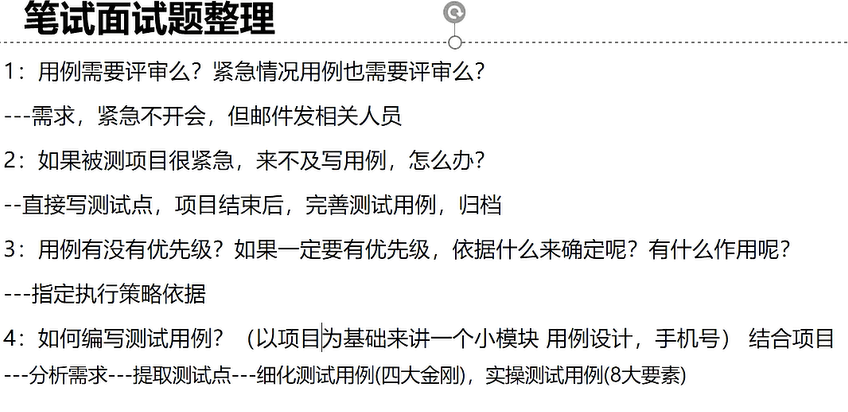
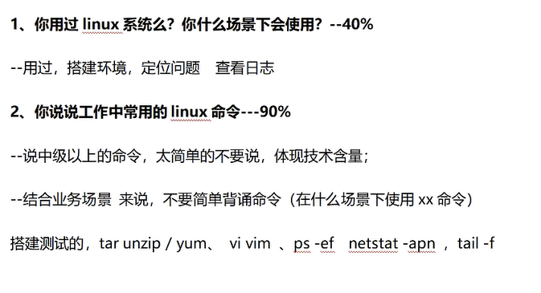
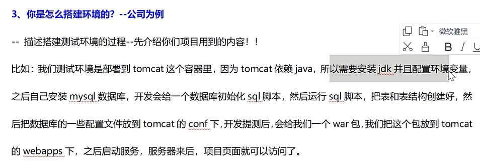
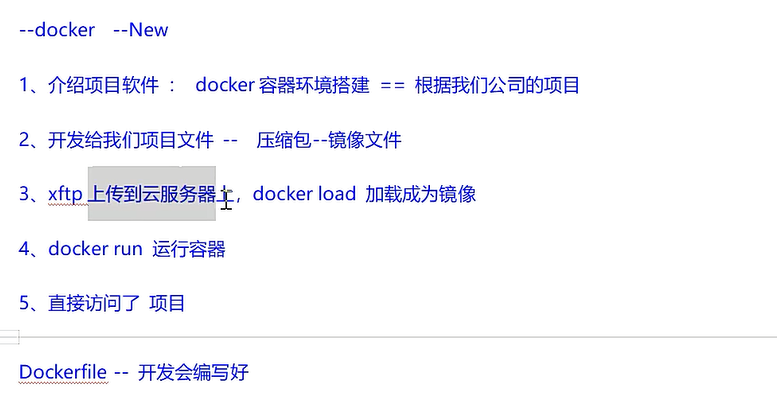

### 产品测试的基本要素

1. 外观界面测试：测试产品的外观界面是否美观，是否符合设计规范。
2. 功能测试：测试产品的各项功能是否能正常使用。
3. 性能测试：测试产品在特定环境下是否能保持它的稳定性。
4. 安全性测试：测试产品自身或在使用过程中是否会产生安全性的问题。
5. 易用性测试：测试产品使用起来是否复杂，用户体验是否良好。
6. 兼容性测试：测试产品使用过程中是否可以兼容其他产品。


### 项目组成员与需求之间的关系


### 评审需求文档


### 软件测试分类表


## 需求评审

### 测试工作是从什么时候开始的？

参考回答：我之前做的测试工作，一般都是在拿到需求文档的时候就开始了，主要的工作就是评审需求文档，评审的目的是消除歧义，完善需求细节，最后达成共识。谢谢。

### 需求评审的目的是什么？

参考回答：我觉得需求评审的目的主要是消除歧义，完善需求细节，最后达成共识，如不进行评审，就意味着开发人员和测试人员可能对需求文档的理解存在偏差，最终可能导致产品质量不符合需求文档的要求。

### 你是如何评审需求文档的？

参考回答：我们公司之前评审需求文档的时候，主要从6个方面进行……

1. 正确性：对照用户的原始需求，检查产品人员制定的需求文档是否偏离了用户的原始需求。
2. 明确性：检查需求文档中每一个需求项是否存在一些含糊其辞的词汇，用语是否清晰，是否有歧义。
3. 完整性：对照用户的原始需求，检查产品人员制定的需求文档是否覆盖了用户所提出的所有需求项，每个需求项有没有遗漏用户所提出的一些必要信息。
4. 限制性：每个需求项里是否清晰地描述了这个软件能做什么，不能做什么，能输入什么，不能输入什么，能输出什么，不能输出什么。
5. 优先级：需求文档中的哪些功能比较重要，哪些功能比较次要，是否做了标识和编号。
6. 一致性：检查需求文档里的内容前后是否一致，确保不冲突，不矛盾。

基本上，我们会从这6个方面进行需求评审，当然每个公司评审的机制可能会有一些差异，但主要目的就是把需求文档的细节理解清楚，谢谢。


### 软件测试计划包括哪些内容？

参考回答：（如果一时记不起来那么多，注意停顿思考一下再回答）我们之前写的测试计划主要包括5个方面。	

1. 第一，测试范围。它指的是系统测试的范围以及本轮测试是测试全部模块还是只测试部分模块。

2. 第二，测试环境。它指的是测试人员是在什么样的软、硬件环境下进行测试。

3. 第三，测试策略。它的内容包括测试的依据、系统测试准入的标准、测试工具的选择、测试的重点及方法、测试准出的标准。

4. 第四，测试管理。它指的是测试任务的分配、时间的限定、测试与开发之间的沟通方式等内容。

5. 第五，测试风险。它指的是测试中如不透彻理解需求文档、估计不足测试时间及测试执行不到位等情况所造成的一些测试风险。

    我们基本上会从这5个方面来制定我们的测试计划。


### 冒烟测试筛选的比例是多少呢？

参考回答：在正常情况下，测试人员筛选的比例大概是整个测试用例的1/15～1/7，测试用例的筛选工作一般是由测试经验相对丰富的测试人员完成的。主要筛选软件中最基本且最重要的一些功能点进行测试。但具体要筛选多少，没有一个具体的规定。一方面要结合测试的时间，另一方面要结合需求规模的大小等因素来考量，当然对于重要的、常用的测试点选择的会多一点。


### 测试用例是你自己写的吗（或是问你是否写过测试用例）？

参考回答：我写过测试用例，一般情况下，我们项目组的测试用例都是各自负责各自模块的用例设计及维护工作，谢谢。

### 测试用例是根据什么来编写的？

参考回答：测试用例都是根据需求文档来写的，谢谢。

### 你们是用什么工具来写测试用例的？

参考回答：一般情况下我们都是用Excel表格来写测试用例的，谢谢。（当然有些公司可能是用自己开发的工具来编写，不管是什么工具来写，写测试用例的步骤和原则是不会变的。）

### 你是怎么设计测试用例的（或是问测试用例是怎么写的）？

参考回答：我觉得设计一个功能模块的测试用例主要是基于几个方面，首先最主要的还是需要参考需求文档，然后尽量挖掘出更多的需求细节进行用例设计；第二，需要凭自己的一些测试经验和常识来设计；第三，可以参考其他同事曾写过的测试用例；第四，可以通过网上的资料做一些补充。基本上我会从这些方面进行用例设计的工作，谢谢。

### 测试用例包括哪些元素？

参考回答：测试序号、测试模块、前置条件、测试环境、操作步骤和数据、预期结果、实际结果、是否通过、备注

### 测试用例有哪些设计方法？

### 测试用例是如何评审的？

参考回答：一般情况下，测试人员会从以下几个方面对测试用例进行评审。（1）测试用例是否是依据需求文档编写的。（2）测试用例中的执行步骤、输入数据是否清晰、简洁、正确；对于重复度高的执行步骤，是否进行了简化。（3）每个测试用例是否都有明确的预期结果。（4）测试用例中是否存在多余的用例（无效、等价、冗余的用例）。（5）测试用例是否覆盖了需求文档中所有的功能点，是否存在遗漏。

### 如何保证测试用例的质量（或什么样的用例才称得上是一个好的用例）？

参考回答：我觉得可以从以下几个方面来保证测试用例的质量。第一，要确保测试用例是针对需求文档编写出来的，要确保测试点能覆盖到所有需求点。第二，要保证操作步骤、具体数据以及预期结果的清晰性、简洁性、明确性，以确保测试用例的可操作性和可复用性（可复用性举例：如测试新版本的时候可直接利用旧版本的测试用例）。第三，确保有足够多的异常测试用例（如无效等值类的测试点），同时要确保没有多余的重复用例。第四，对测试用例进行评审。基本上，我会从以上4个方面来确保测试用例的质量，谢谢。

### 如果没有需求文档，直接给你待测软件，你将如何开展测试工作？

参考回答：第一，我会大体地测试一下软件，对于如边界值、输入数据类型等需求不明确的问题集中反馈给产品经理，待产品经理给出相应的标准后再设计用例。第二，在测试软件的过程中，如发现有些功能模块需求非常不明确，甚至影响到用户对产品功能的正确使用，对于这类重大问题，我会及时反馈给测试经理，然后协助其来解决这类问题。第三，我会积极参加项目的各种讨论会议；查看已有的测试用例、Bug库中已有的Bug、已有的用户手册和帮助文档；咨询产品人员并尽可能多地了解相关的需求信息，并以此为基础来设计测试用例。第四，可以参考软件的功能直接设计用例，然后提交给测试组（必要的情况下可以提交给整个项目组）进行评审，以得到统一的意见。基本上，我会从以上几个方面来开展测试工作并设计测试用例，谢谢。


### 问题1：你搭建过测试环境吗？

参考回答：目前我们主要搭建的是前台的测试环境，如安装操作系统、浏览器、虚拟机等，后台环境一般是由测试组的专门人员进行搭建。我本人对后台中关于Web服务器、数据库服务器、其他服务软件的搭建只是了解而已，谢谢。（当然如果大家通过相应的学习后对后台的搭建已经很熟悉了，则可以一起作答。）

### 问题2：你们和开发人员共用一套环境吗？

参考回答：我们做的项目测试都没有和开发人员共用一套环境，我们测试人员会自己搭建相应的环境。如果共用一套环境的话难免会对测试的结果产生一些影响，而且系统维护起来也不方便，因为开发人员也在这套环境中调试产品。谢谢。

问题3：你是做前台（前端）测试的，还是做后台（后端）测试的？

参考回答：目前我主要是做前台测试。谢谢。

问题4：你是做B/S结构软件测试的，还是做C/S结构软件测试的？

参考回答：我目前做的项目主要是以B/S为主。（无论是做B/S结构软件的测试还是做C/S结构软件的测试，测试的思想都是一样的，具体怎么回答视大家所做的项目和兴趣而谈。）

问题5：网页的兼容性测试你是怎么做的？

参考回答：对于网页兼容性我们主要考虑的是各种浏览器对前台页面的兼容性，因为浏览器对页面的影响是最大的。现在浏览器的种类越来越多，网页中展现出来的内容也越来越丰富，这些内容包括网页中的字体、图片、动画等，而且有些内容需要网页安装一些插件才能打开。很多时候同一个网页在不同的浏览器下，可能会出现兼容性问题，有些浏览器可以正常显示，有些浏览器不能正常显示，例如出现乱码、排版异常、无法显示图片和动画、页面的功能不能正常使用等异常情况，所以一般情况下，都应针对当前主流的浏览器进行兼容性测试。

目前主流的浏览器有IE系列、Google的Chrome浏览器、火狐浏览器（Mozilla Firefox）、360浏览器、QQ浏览器、搜狗浏览器等。具体要测试哪些浏览器，主要根据产品经理制定的需求文档而定。但如果页面上所有的功能都需要在每个浏览器重新测试一遍的话（假如需求文档要测试6款浏览器），工作量也是非常大的。一般情况下，可以这样分配，例如测试组有6个人是做功能模块测试的，那么这6个人就会分别选用其中的一款浏览器进行测试。这样就可以将浏览器分散开来，而不需要一个人来完成，后面还可以交换着进行（你用我的浏览器，我用你的浏览器），尽量覆盖全面。其次要考虑的就是分辨率的兼容性，这指的是页面在640×400、600×800、1024×768或是更高的分辨率模式下是否能正常显示，例如字体是否太小，文本、图片等页面元素是否能正常显示。对于具体要使用什么样的分辨率进行测试，通常情况下，需求文档中都会对分辨率给出建议和要求。


## 执行测试

> 技术bug定义：

技术bug是指计算机软件或程序中存在的某种破坏正常运行能力的问题导致软件产品在某种程度上不能满足用户的需要，即不是因为产品最初设计未考虑全面导致的bug。

> bug级别的定义：

| 级别   | 定义                                                         | 处理时效             | 知晓级别                                                     |
| ------ | ------------------------------------------------------------ | -------------------- | ------------------------------------------------------------ |
| 紧急P0 | 严重程度为致命且影响用户范围大（影响5个用户以上-商品） 客户安全问题，数据泄露（客服可选择） | 立即处理解决         | CEO（包括设计P1/P2/P3 人员）                                 |
| 高P1   | 一个月出现5个用户及以上反馈同一个问题（测试工程师进行问题聚合判定是否为P1，同时客服也可手动选择） | 72h内解决            | 业务负责人CTO（包括设计的P2/p3人员）                         |
| 中P2   | 出现致命/严重问题的情况（手动选择）                          | 进入下一迭代计划解决 | 所属业务团队内部（产品经理/研发负责人/研发工程师/测试工程师） |
| 低P3   | 根据影响的用户数来升级（系统默认为P3）                       | 四个迭代周期内解决   | 不做强制要求                                                 |

```
注：
1. 适用于爱用商品业务；
2. Bug处理的优先级高于需求；
3. 当bug严重程度为严重级别时，转需求也需立即处理；
4. 若出现退款，差评投诉，威胁，单个用户出现系统致命/严重问题等情况下，客服可手动选择紧急P0问题，研发人员接收此信息需立即处理/回复；
5. 当客服选择P0/P1时，会先流经业务负责人审核，业务负责人可以修改bug级别，若业务负责人超过1h不处理，直接默认客服所选的等级。
```


### 一个完整的Bug包括哪些内容？


### 一个Bug包括哪些常用状态？

### Bug的处理流程是怎样的？


### 如何提交一个高质量的Bug？

参考回答：我个人觉得提交一个高质量的Bug，以下几点很重要。第一点是Bug的概要，通过Bug概要可以让项目组其他成员知道这个Bug单描述的是什么问题；第二点是Bug的具体描述，也就是Bug重现的步骤，Bug记录的细节越详细越好，包括出错前后所执行的操作步骤、所涉及的具体数据等；第三点是附上相应的截图和日志，特别是截图，清晰和正确的截图能为此Bug提供有力的说明和证据；第四点是所测软件的版本号及测试的环境要写清楚，不同的版本，不同的环境都可能造成不同的测试结果。当然Bug的其他信息点都应当正确描述。

### 如果你发现的这个Bug的操作步骤在测试用例中没有提到，你怎么处理？

参考回答：这就需要把发现这个Bug的操作步骤补充到测试用例当中，以便下一次测试时能注意到这个问题。

### 如果你和开发人员对Bug发生了争议，你怎么处理？

参考回答：测试人员和开发人员因Bug起争议的事情常有发生，例如开发人员认为这不算是一个Bug，或认为这个Bug不重要，不需要修改，而测试人员认为这是一个很严重的Bug，需要开发人员修改，或因其他原因起了争议等。如果出现了这些情况，测试人员应如何处理呢？本书给出以下建议。（1）任何争议都需要“对事不对人”，不能因为Bug而激化了双方的矛盾。（2）有很多初级软件测试人员提交的Bug单流转到开发人员那里后，开发人员看不懂。原因在于测试人员提交的Bug单没有描述清楚，这是一个非常常见的现象。测试人员提交的Bug单一定要描述清楚，并需要有充足的依据和理由。（3）如果Bug单写清楚了，但开发人员还是不愿意修改的话，可以找一个合适的时间，心平气和地与开发人员沟通，说明此Bug对产品质量可能产生的不良影响，测试人员在沟通过程中不能意气用事。（4）经沟通后，如果开发人员还是不愿意修改的话（当然开发人员不修改也有他们的原因），那么此时可以向测试经理汇报这一情况，由测试经理出面解决，或是由测试经理召开Bug评审大会（开发人员、测试人员、产品经理三方人员参与，有时也包括项目经理），共同定夺。

### 如果你发现了一个Bug，但之后再也没法重现，你怎么办？

参考回答：遇到这类问题，我首先会截图，并搜集日志，以保留好测试现场。没有重现的问题可能是没有触发引起此Bug发生的某个点，所以作为测试人员我会想方设法尽可能地让这个Bug重现。如果实在无法重现，我还是会提交此Bug给开发人员，如果有截图和日志，也将一并附上。如果开发人员要求重现，那测试人员就需要在后期继续观察，如果最终还是无法重现，则会把此问题反应给测试经理，由测试经理同开发人员进行评审以及商量解决的方法。虽然现在没有重现，但是不能保证在用户那里不会出现。

### 如果开发人员不修改你发现的Bug，给出的原因是修改的成本比较高，这个Bug只是影响用户体验而已，你怎么办？

参考回答：我觉得凡是影响用户体验的问题都是大问题，如果用户体验没有做好，我觉得这就不是一款好的产品。其次如果每个问题都因修改成本高而不去修改的话，是无法持续提升产品质量的，我觉得只要是问题，无论大小，测试人员都应当要求开发人员去修改。这是对产品负责，也是对用户负责。

### 你所了解的测试管理工具有哪些，你用的是什么？

参考回答：我所了解的测试管理工具有TD、QC、禅道、Mantis、JIRA等。我之前的项目组所使用的测试管理工具是禅道。

### 一个软件版本，你们一般要测试多长时间？

参考回答：一般情况下，一个软件版本要测试三到五轮，每一轮的测试时间也不能一概而定，受很多因素的影响，例如会受需求规模、测试人员、测试技术、软件的质量等各方面因素的影响，具体要视实际情况而定。

### 能讲一下回归测试的基本策略吗？

参考回答：（1）回归测试时执行全部的测试用例。（2）选择重要的功能点、常用的功能点、与Bug相关联的功能点进行回归测试。（3）选择性执行关键功能点的测试用例。（4）仅测试出现Bug的功能点。


## 编写测试报告

### 你写过测试报告吗？

参考回答：写过，不过我们写的都是我们自己所负责模块的测试报告，整个系统的测试报告由测试经理整理完成。

### 一份测试报告都包括哪些内容？

（1）测试过程

测试过程需要对测试人员、测试时间、测试地点、测试版本等信息进行描述。其他测试过程中发生的关键信息均可在这里进行描述。

（2）测试环境

测试环境指的是软件环境和硬件环境（主要描述前台环境，此环境同测试计划中的环境），其他相关联的辅助环境均可在这里进行描述。

（3）测试范围

测试范围指的是具体所测模块及分布在该模块上的所有功能点。与之有关联的信息也可在这里进行描述。

（4）测试结果

测试结果主要指测试用例执行情况的汇总、执行结果通过率、Bug的问题汇总、Bug的分布情况等。其他有关联的测试结果均可在这里进行描述。

（5）系统存在的风险

系统存在的风险主要指的是系统中遗留的Bug会对软件造成什么风险。其他风险信息均可以在这里进行描述。

（6）测试结论

测试结论指在报告的最后给出一个是否能上线（通过）的结论。

（7）附件清单

附件清单主要指测试用例的清单和Bug清单，这些清单也需要一并放在测试报告中。

### 软件测试工作结束的标准是什么？

分析：软件测试工作的结束并没有一个固定的标准，都是相对的，对于初级软件测试人员而言，可以从大家熟悉的话题进行阐述。

参考回答：我觉得软件测试结束的标准有以下几个前提。第一，我们已按照测试计划中的安排完成了所有的测试工作。第二，测试用例已全部执行完成，并且执行通过率达到标准。第三，每个测试人员手上的Bug都处于关闭状态。第四，回归测试全部执行完毕，没有发现会影响产品上线的Bug，软件产品达到了上线标准。第五，每个测试人员所负责的测试报告已完成，并提交给了测试经理。如果上面的工作都已完成，我觉得测试工作就基本结束了。

### 软件的测试流程是怎么样的？

参考回答：一般情况下，一个完整的测试流程包括需求评审、测试计划制定、测试用例设计、用例评审、环境搭建、测试执行（提交Bug、回归测试）、撰写测试报告等。

### 软件测试是在什么阶段介入的？

参考回答：一般情况下，对于功能测试人员，我们是在进行系统测试的时候介入的。

### 你如何理解测试这一份工作？

参考回答：我觉得软件测试的主要任务是发现软件中的Bug，所以软件测试对于软件的质量有明显的改善作用。其次，测试人员测试的对象是开发人员开发出来的软件产品，所以对于开发工作能起到一定的监督和推动作用。最后，我觉得软件测试能缩短软件开发的周期，加速软件发布的进程。

### 如果我们录取了你，你将如何更快地进入工作状态？

参考回答：首先，我会熟悉项目组成员情况，包括开发人员、测试人员、产品人员。其次，我会从熟悉需求文档开始，依次熟悉测试组的测试用例、Bug管理工具以及Bug库里已提交的Bug。最后，我会向测试组的老同事或我的导师请教测试组的基本工作流程等细节问题，并结合测试经理所分配的任务，通过这些任务熟悉整个测试流程和工作要点。

### 软件测试能否发现所有的Bug？

参考回答：我觉得软件测试受测试时间、测试人员的数量、测试人员的技术等方面的因素，是没有办法发现所有Bug的。有些Bug需要在特殊环境下或是长期使用软件的情况下才能被发现。一般情况下，软件交付给用户使用后，都不应该有影响用户使用和体验的Bug出现。万一在用户使用的过程中发现了Bug，那应该迅速打补丁或是升级软件。

### 软件测试应遵循什么原则？

参考回答：我觉得软件测试应遵循80/20原则，即容易出现问题的模块或是问题较多的模块要重点测试。

### 一份测试报告都包括哪些内容？

参考回答：测试报告包括的内容有软件的测试环境、测试依据等。测试环境指的是软件环境、硬件环境以级其他相关联的辅助环境。测试依据指的是测试用例和需求文档以及相关联的文档等。


## 笔试

### 1. 用例需要评审吗？紧急情况用例也需要评审吗

需要，紧急情况下不会开会，但会发邮件给相关人员





## Linux








---

## 计算机网络

### 1. TCP和UDP的区别？

TCP和UDP都是传输层的协议

> TCP 传输控制协议

- 面向连接（一对一）
- 面向字节流的可靠传输
- 传输的数据单元是TCP报文段
- 流量控制（抑制发送端发送数据的速率，以便使接收端来得及接受）
- 拥塞控制（防止过多的数据注入到网络中，使网络中的路由器或链路过载，导致数据丢失）
- 全双工通信（双方既是发送方也是接收方）

> UDP 用户数据报协议

- 无连接（一对多）
- 不可靠传输
- 传输的数据单元是用户数据报
- 没有流量控制和拥塞控制


### 2. 3次握手4次挥手

